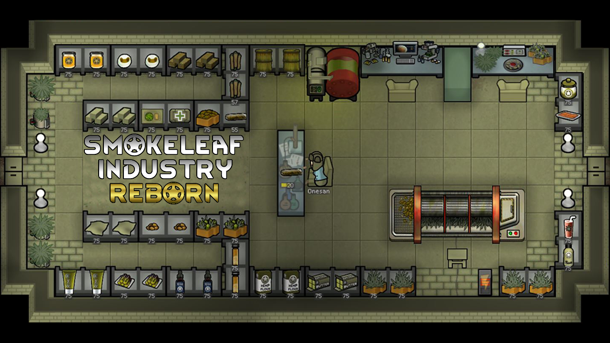
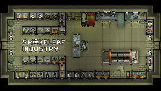

# Smokeleaf-Industry-Reborn (Continued)

## A RimWorld Mod

Smokeleaf Industry Reborn is a mod that adds various new drugs, foods, medicines, building materials and more all based around smokeleaf cultivation and processing.  All items added by the mod are based on real world applications of "smokeleaf" and it's byproducts.  Medicinal, recreational and industrial uses are all included.  Research must be conducted in order to unlock the various items and their uses.

### Changes

#### Tolerance/dependence

The addiction system for all smokeleaf products had an overhaul. Pawns now build tolerance to smokeleaf (as a drug) instead of specific methods of consumption, and become dependent on the drug, if they use too much. Some methods increase tolerance faster than others.  Pawns will be able to get their fix from anything containing smokeleaf, instead of only cookies or joints, etc.  They can even get high from eating raw buds if they are getting desperate.

Dependent pawns who are suffering withdrawal will have a chance of going on a smokeleaf binge or an eating binge (or possibly even a smokeleaf brownie eating binge... dear lord)

#### Getting high

Depending on the method of consumption, the severity of the initial high will differ.  For example, smoking a joint will result in 'Stoned on smokeleaf (euphoric)' which is level 2 for severity.  Smoking an entire cannagar will result in 'Stoned on smokeleaf (completely wrecked)' which is level 4 for severity. Smoking/consuming repeatedly (using any method) will further increase the severity of the high, to the point that a pawn may be greening out.  Being high will dissipate over time, and completely wear off in roughly 1 day for the most extreme highs.

The benefits and negatives of being high have been overhauled as well, to offer what I believe to be a more accurate reflection of how smokeleaf would impact a pawn.  Smokeleaf is extremely effective for mild pain, and increased consumption will help more with severe pain.  There is no longer negative impact to consciousness and moving speed.

Here is a list of the changes you can expect your pawn to see if they get high:

- Decreased pain
- Increased joy (chemical and/or gluttonous)
- Decreased chance of mental break (switches to increased chance if greening out, though)
- Decreased work speed
- Decreased learning rate
- Increased hunger rate
- Increased tiredness
- Increased chance of an eating binge at more severe levels
- Chance of vomiting when 'greening out' (cannabinoid hyperemesis syndrome), as well as other minor mental breaks due to increased likelihood of panicking.

These changes increase in severity depending on how high your pawn gets.

#### Methods of consumption

Some methods of consumption are more 'socially acceptable' than others.  For example, a pawn will be more likely to experiment with a joint than to go straight to the chemfuel hash oil.

Pawns will also have higher thoughts of themselves depending on the method of consumption.  Despite getting high, a pawn that needed to resort to eating raw buds is going to feel shitty about this.  A pawn that manages to get their hands on a cannagar is going to feel like royalty.

#### Pharmacology

There are 5 pharmacologic smokeleaf items you'll be able to see in game, and now each of them have their own rather distinct purpose in game.

- CBD: Slightly less effective alternative to regular medicine.
- Infused Medicine: Slightly less effective alternative to Glitterworld medicine.
- Smokeleaf lotion: Reduces pain, aids in movement and manipulation.
- Smokeleaf pills: Aids in prevention and recovery from illnesses, and reduces pain.
- Smokeleaf tincture: Reduces pain, and helps pawns get a better night's sleep.

All smokeleaf social drugs are great to help ease pain, reduce mental break threshold, and increase mood.

#### Research

The research tree has been revamped to make access to smokeleaf items more accessible.  Depending on a classic/tribal start, you will start with some basic research already completed.  CBD has been lowered from 'Smokeleaf pharmacology' and locked behind 'Industrial smokeleaf processing' instead. This, I feel, better reflects a gradual understanding of the medicinal benefits of smokeleaf.

\
\
Original (Ogliss) mod on Steam Workshop:

>### [**Smokeleaf Industry**](https://steamcommunity.com/sharedfiles/filedetails/?id=2018570327)
>
>

\
This work is licensed under a <a rel="license" href="http://creativecommons.org/licenses/by-nc-sa/4.0/">Creative Commons Attribution-NonCommercial-ShareAlike 4.0 International License</a>.
